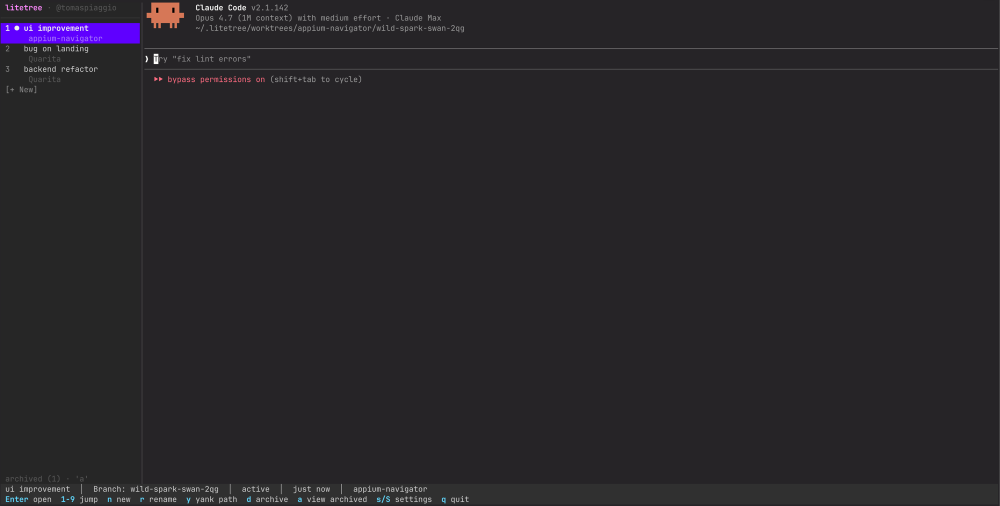

# treemux

A terminal UI for managing git worktrees with a coding agent embedded in each one. Spin up a new branch, get a worktree + a Claude Code (or Codex / OpenCode / custom) session running in it, switch between them instantly.



## What it does

- Each worktree = its own branch + its own directory under `~/.treemux/worktrees/<project>/<branch>/` + its own long-running PTY.
- Default command in a new worktree is `claude --dangerously-skip-permissions`. Subsequent opens add `--continue` so the conversation resumes.
- You can also pick `codex --full-auto`, `opencode`, or a custom command.
- Project setup scripts (e.g. `pnpm i`, `cp .env .env.local`) run automatically when a worktree is created.
- PR detection via `gh` — if you have `gh` installed and a PR exists for the branch, its number shows in the sidebar.
- Archive is a soft-delete (status flip, files stay). A separate archived view lets you restore or permanently delete.

## Install / run

Requires [Bun](https://bun.sh) (uses `bun:sqlite`, `Bun.spawn`).

```bash
git clone <this repo>
cd treemux
bun install
bun run dev
```

On first run, you'll be prompted for:
1. The local path to a git repository (Tab completes, `~` works).
2. A project name (defaults to the repo's directory name).
3. The default command to run in each new worktree of this project.
4. Optional setup scripts to run on worktree creation, one per line.

You can also register projects from the CLI without entering the TUI:

```bash
bun run dev project add --name myapp --repo /Users/you/code/myapp --command claude --setup "pnpm i"
bun run dev project list
bun run dev project remove <id>
```

## Keyboard

### Sidebar (active view)

| Key                | Action                                      |
| ------------------ | ------------------------------------------- |
| `Enter` / click    | open the selected worktree (hides sidebar)  |
| `1`–`9`            | jump directly to worktree N                 |
| `n`                | new worktree (or new project from picker)   |
| `r` / double-click | inline-rename the worktree                  |
| `d`                | archive (soft-delete; files stay)           |
| `o`                | open the worktree in an external editor     |
| `y`                | copy the worktree's path to clipboard       |
| `s` / `S`          | per-project / global settings               |
| `a`                | switch to archived view                     |
| `Ctrl+B`           | hide sidebar (terminal full-screen)         |
| `q`                | quit                                        |

### Sidebar (archived view)

| Key            | Action                                            |
| -------------- | ------------------------------------------------- |
| `u` / `r`      | restore the worktree to active                    |
| `D` (shift+D)  | permanently delete (`rm -rf` + DB row)            |
| `a` / `Esc`    | back to active view                               |

### Terminal focus

| Key                       | Action                                       |
| ------------------------- | -------------------------------------------- |
| `Ctrl+B`                  | toggle sidebar visibility (and focus it)     |
| `F1`–`F9`                 | jump to worktree N from anywhere             |
| `Ctrl+O`                  | open editor picker                           |
| `Shift+↑` / `Shift+↓`     | scroll the terminal back / forward 1 line    |
| `Shift+PgUp` / `Shift+PgDn` | scroll by a page                           |

### Rename / setup-script editor

`Cmd+Delete` clears the whole input; `Opt+Delete` deletes the last word — matching macOS conventions. Multi-line setup scripts use `Ctrl+D` to save, `Esc` to cancel.

## Selecting & copying from the embedded terminal

When focus is on the terminal, treemux disables mouse reporting so your terminal's native drag-to-select + Cmd+C work normally. If you want even more room, press `Ctrl+B` from sidebar focus to hide the sidebar entirely — the terminal expands to fill the window.

If you prefer to keep the sidebar visible: in iTerm2 hold **Option** while dragging to do a rectangular selection that excludes the sidebar columns.

## Storage

All state lives in `~/.treemux/`:

- `~/.treemux/treemux.db` — SQLite. Tables: `projects`, `worktrees`, `app_settings`.
- `~/.treemux/worktrees/<project>/<branch>/` — actual git worktrees.

Permanent delete uses `rm -rf` + `git worktree prune`. It intentionally does **not** invoke `git worktree remove --force`, which has historically hung indefinitely on dirty trees or stale lock files.
